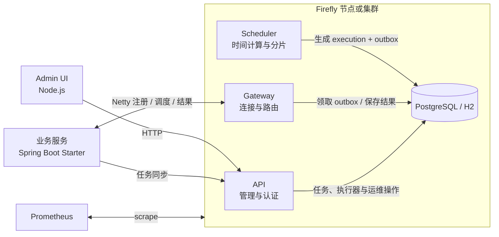
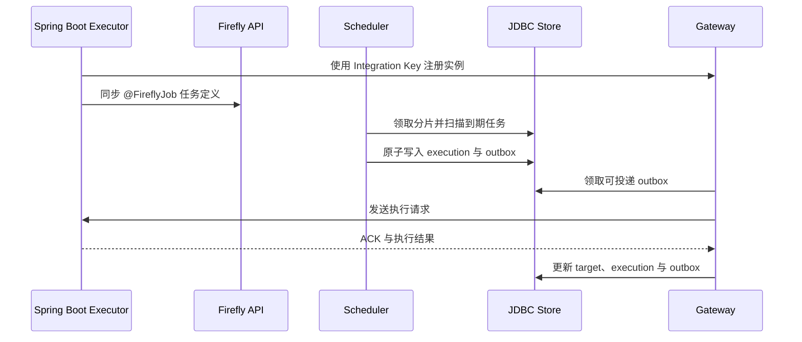

<p align="center">
  
</p>

<h1 align="center">Firefly</h1>

<p align="center">
  面向 Java 21 的轻量级分布式任务调度平台。<br>
  关注准时调度、可靠投递、弹性执行器、高可用与低成本集成。
</p>

<p align="center">
  
  
  
  
</p>

<p align="center">
  <a href="https://fishered.github.io/firefly-home/">官方网站</a> ·
  <a href="https://fishered.github.io/firefly-home/guide/quick-start">Starter 快速手册</a> ·
  <a href="https://fishered.github.io/firefly-home/guide/integration">集成文档</a> ·
  <a href="https://fishered.github.io/firefly-home/reference/admin-api">Admin API</a> ·
  <a href="README_EN.md">English</a>
</p>

---

## Firefly 是什么

Firefly 将任务定义、调度决策和业务执行分离：Scheduler 负责计算触发时间并生成可靠投递记录，Gateway 负责维护执行器长连接和路由，业务服务只需引入 Starter 并声明任务方法。API、Gateway、Scheduler 可以运行在同一进程，也可以按角色拆分为多个节点。

它适合以下场景：

- Spring Boot 服务中的周期任务和后台作业
- 需要广播、分片、选举单次执行或多实例路由的任务
- 需要执行记录、失败重试、超时、取消和审计的调度平台
- 依赖 PostgreSQL 共享状态并要求节点故障接管的调度集群
- 希望保留轻量核心，同时按需启用管理 API、Metrics 和外部插件的系统

## 核心能力

| 领域 | 能力 |
| --- | --- |
| 时间语义 | 6 位 Cron、fixed-rate、任务级 IANA `ZoneId`、DST 处理、UTC `Instant` 游标 |
| 补偿策略 | `SKIP`、`FIRE_ONCE`、`CATCH_UP`，支持补偿次数上限和 misfire grace |
| 并发控制 | `ALLOW`、`FORBID`，避免同一任务不受控地重叠执行 |
| 分发模式 | `UNICAST`、`BROADCAST`、`SHARDING` |
| 路由策略 | `ROUND_ROBIN`、`RANDOM`、`CONSISTENT_HASH` |
| 完成策略 | `ALL_SUCCESS`、`ANY_SUCCESS`、`QUORUM` |
| 失败处理 | 发送 ACK、超时、业务重试、失败目标重试、死信与手动重放 |
| 高可用 | 节点心跳、Scheduler 分片、租约、fencing token、数据库时钟校准 |
| 可靠投递 | execution 与事务 Outbox 同库持久化，Gateway 按角色领取并回写结果 |
| 执行器 | Netty 长连接、多 Gateway、自动重连、心跳、优雅注销、实例隔离 |
| 集成 | 单一 Spring Boot Starter、注解任务发现、启动任务同步、传统 Java 嵌入式 API |
| 运维 | 独立 Admin UI、Admin API、JWT 会话、Integration Key、审计、Prometheus Metrics |
| 扩展 | Plugin SPI、类路径插件、外部插件目录、插件生命周期与状态展示 |

## 架构



默认 standalone 节点同时承担 `API`、`GATEWAY`、`SCHEDULER` 三个角色。集群模式下，多个节点共享 PostgreSQL，并通过分片租约和 fencing token 防止旧节点继续提交过期结果。

## 五分钟本地启动

### 环境要求

- JDK 21
- Node.js 18 或更高版本，用于运行 Admin UI
- Docker Desktop，可选
- PostgreSQL，可选；首次体验推荐 H2

### 1. 获取项目并运行测试

```powershell
git clone https://github.com/fishered/Firefly.git
cd Firefly
.\gradlew.bat test
```

Linux 或 macOS：

```bash
./gradlew test
```

### 2. 使用 H2 启动 Firefly Server

```powershell
.\gradlew.bat :server:launcher:run --args="--firefly.config.profile=h2"
```

H2 profile 使用 `./data/firefly` 文件存储，默认关闭 JWT，适合本地开发。只做临时验证时也可以使用 memory profile：

```powershell
.\gradlew.bat :server:launcher:run --args="--firefly.config.profile=memory"
```

memory profile 在进程退出后丢失全部数据。

希望启动后立即看到内置示例任务，可以同时启用 demo：

```powershell
.\gradlew.bat :server:launcher:run --args="--firefly.config.profile=h2 --firefly.demo.enabled=true"
```

### 3. 启动 Admin UI

打开第二个终端：

```powershell
cd ui\admin
npm start
```

访问以下地址：

| 服务 | 地址 | 用途 |
| --- | --- | --- |
| Admin UI | <http://127.0.0.1:9720> | 任务、执行器、执行记录、节点、插件和配置 |
| Admin API | <http://127.0.0.1:9710/api/health> | 管理 API 与健康检查 |
| Metrics | <http://127.0.0.1:9711/metrics> | Prometheus 文本指标 |
| Executor Gateway | `127.0.0.1:9700` | 业务执行器 Netty 连接 |

H2 和 memory 默认关闭认证，Admin UI 会直接创建带 CSRF 和空闲超时保护的本地会话。`pg` profile 默认开启认证；新数据库初始化账号为 `admin/admin`，首次登录后应立即修改密码。

## 使用 PostgreSQL

PostgreSQL 是生产部署和集群模式的推荐共享存储。启动 Server 前设置：

```powershell
$env:FIREFLY_CONFIG_PROFILE='pg'
$env:FIREFLY_STORE_TYPE='jdbc'
$env:FIREFLY_JDBC_URL='jdbc:postgresql://127.0.0.1:5432/firefly'
$env:FIREFLY_JDBC_USERNAME='postgres'
$env:FIREFLY_JDBC_PASSWORD='your-database-password'
$env:FIREFLY_JDBC_DIALECT='postgresql'
$env:FIREFLY_JDBC_SCHEMA_MODE='initialize-if-empty'
$env:FIREFLY_SECURITY_JWT_SECRET='replace-with-a-long-random-secret'

.\gradlew.bat :server:launcher:run
```

Firefly 会幂等初始化并校验数据库结构。已有 `admin` 用户、任务、执行记录和密钥不会在普通重启时被覆盖。

配置优先级为：

```text
命令行参数 > 环境变量 > profile 配置 > 主配置文件 > 代码默认值
```

内置 profile：

| Profile | 存储 | 默认认证 | 适用场景 |
| --- | --- | --- | --- |
| `pg` | PostgreSQL JDBC | 开启 | 持久化部署、集群和高可用 |
| `h2` | 本地 H2 文件 | 关闭 | 本地开发、功能验证 |
| `memory` | 进程内存 | 关闭 | 单元测试、短时实验 |

## Docker 部署

仓库提供两个独立镜像：

| 镜像 | 容器端口 | 职责 |
| --- | --- | --- |
| `firefly/firefly-server:1.0.0` | `9700`、`9710`、`9711` | Gateway、Admin API、Scheduler、Metrics |
| `firefly/firefly-admin-ui:1.0.0` | `9720` | Web UI、浏览器会话和 Admin API 反向代理 |

准备配置并启动：

```powershell
Copy-Item .env.example .env
# 根据数据库位置修改 .env 中的 FIREFLY_JDBC_URL、用户名、密码和 JWT secret
docker compose up -d --build
docker compose ps
```

数据库地址取决于部署位置：

| PostgreSQL 位置 | JDBC 主机名示例 |
| --- | --- |
| Compose 中名为 `postgres` 的服务 | `jdbc:postgresql://postgres:5432/firefly` |
| Docker Desktop 宿主机 | `jdbc:postgresql://host.docker.internal:5432/firefly` |
| 同一 Docker 网络中的独立容器 | 使用该容器的服务名或网络别名 |
| 外部数据库 | 使用容器可达的 DNS 名称或 IP |

容器中的 `127.0.0.1` 指向容器自身，不能用来访问宿主机 PostgreSQL。

常用命令：

```powershell
docker compose logs -f firefly-server
docker compose logs -f firefly-admin-ui
docker compose restart firefly-server firefly-admin-ui
docker compose down
```

完整说明见[部署文档](https://fishered.github.io/firefly-home/guide/deployment)。

## Spring Boot 快速集成

Starter 快速手册：[https://fishered.github.io/firefly-home/guide/quick-start](https://fishered.github.io/firefly-home/guide/quick-start)

### 1. 引入唯一 Starter

Firefly 的公共构件发布在 Maven Central，Maven 项目无需增加额外仓库：

```xml
<dependency>
    <groupId>io.github.fishered</groupId>
    <artifactId>firefly-spring-boot-starter</artifactId>
    <version>1.0.1</version>
</dependency>
```

业务项目只需要这个 Starter。Netty 客户端、处理器发现、任务同步、心跳、重连和 Spring 生命周期均由自动配置完成。

### 2. 生成 Integration Key

打开 Admin UI 的“配置”页面，生成 Integration Key。明文只返回一次，服务端只保存摘要。该密钥只用于：

- Executor 向 Gateway 注册
- Starter 在启动时查询、创建或更新声明式任务

Integration Key 不能执行 Admin 用户管理、手动触发、节点排空等管理操作。

### 3. 配置业务服务

```yaml
spring:
  application:
    name: billing-service

firefly:
  executor:
    name: billing-executor
    gateway-addresses:
      - 127.0.0.1:9700
    integration-key: ${FIREFLY_INTEGRATION_KEY}
    job-registration:
      admin-url: http://127.0.0.1:9710
      update-existing: false
      fail-fast: false
```

生产环境可以配置多个 Gateway 地址。Executor 会同时维护连接，并在断线后指数退避重连和重新注册。

### 4. 声明任务

```java
import com.firefly.domain.ExecutionContext;
import com.firefly.spring.annotation.FireflyJob;
import org.springframework.stereotype.Component;

@Component
public class BillingJobs {

    @FireflyJob(
            name = "每日账单处理",
            cron = "0 0 2 * * *",
            zoneId = "Asia/Shanghai",
            parameters = {
                    "tenant=primary",
                    "source=billing-service"
            }
    )
    public void billingHandler(ExecutionContext context) {
        System.out.println("jobId=" + context.jobId());
        System.out.println("executionId=" + context.executionId());
        System.out.println("parameters=" + context.parameters());
    }
}
```

Starter 使用全限定类名和方法名自动生成入口与任务 ID，例如：

```text
com.example.billing.BillingJobs#billingHandler
```

因此不需要手工维护全局任务 ID 或处理器名称。任务方法必须返回 `void`，并使用以下任一签名：

```java
public void billingHandler()

public void billingHandler(ExecutionContext context)
```

`ExecutionContext` 提供 `executionId`、`rootExecutionId`、重试次数、任务 ID、时间点和参数。业务副作用应以 `rootExecutionId` 或稳定业务键实现幂等。

## 其他集成入口

| 场景 | 模块或命令 | 说明 |
| --- | --- | --- |
| 传统 Java 嵌入式调度 | `integrations:embedded` | 在当前 JVM 中创建 `FireflyScheduler` 并注册任务与处理器 |
| 嵌入式最小示例 | `.\gradlew.bat :examples:embedded-basic:run` | 不依赖 Spring 或远程 Gateway |
| 原生 Netty Executor | `clients:executor-netty` | 适合自行管理客户端生命周期的 Java 服务 |
| Netty 最小示例 | `.\gradlew.bat :examples:netty-executor-basic:run` | 连接已启动的 `127.0.0.1:9700` Gateway |

Spring Boot 是业务服务的推荐接入方式；Embedded 更适合单进程应用和测试，原生 Netty Client 适合需要完全控制 Executor 生命周期的框架集成。

## 一次任务如何执行



任务重试会产生新的 attempt；`rootExecutionId` 在同一重试链中保持稳定。广播和分片默认只重试失败、超时或缺失目标，也可以显式配置 `ALL_TARGETS`。

## 节点角色与高可用

单节点默认配置：

```properties
firefly.node.mode=standalone
firefly.node.name=firefly-standalone
firefly.node.roles=api,gateway,scheduler
```

集群模式要求：

- 所有节点共享同一个 PostgreSQL 数据库
- 每个节点使用唯一的 `firefly.node.name`
- 所有节点使用一致的 shard count、JWT secret 和集群协议配置
- Executor 配置多个 Gateway，或使用可达的负载均衡入口
- 滚动下线前先执行节点排空，停止领取新任务并释放 Scheduler 分片
- 业务处理器仍需对外部副作用实现幂等

第一阶段推荐部署三个全角色节点：

```properties
firefly.node.mode=cluster
firefly.node.name=firefly-node-1
firefly.node.roles=api,gateway,scheduler
```

分片租约和 fencing token 用于避免旧 Scheduler 在失去所有权后继续推进任务；Outbox 的 claim owner 与 attempt fencing 用于避免投递租约过期后的迟到写入覆盖新节点状态。

完整约束见 [JDBC 与 HA](https://fishered.github.io/firefly-home/features/ha-cluster)。

## 项目结构

```text
firefly/
├── libs/scheduler-core                  # 纯 Java 调度模型与核心算法
├── server/runtime                       # Scheduler、Outbox、协调器运行时
├── server/bootstrap                     # 配置解析、模块装配与生命周期
├── server/launcher                      # 独立 Server 启动入口
├── stores/jdbc                          # PostgreSQL、H2、MySQL schema 与仓储
├── transports/netty                     # Gateway 协议、路由与跨 Gateway 转发
├── clients/executor-netty               # 业务侧 Executor 客户端
├── integrations/firefly-spring-boot-*   # Spring Boot Starter 与自动配置
├── integrations/embedded                # 非 Spring 嵌入式集成
├── apis/admin-http                      # Admin HTTP API
├── ui/admin                             # 独立 Node Admin UI
├── plugins/plugin-api                   # 插件 SPI 与生命周期
├── plugins/metrics-prometheus           # Prometheus Metrics 插件
├── examples                             # 最小集成示例
└── config                               # 主配置与 pg/h2/memory profiles
```

调度核心不依赖 Spring、HTTP、Netty 或具体数据库。传输、存储、管理 API、UI 和 Metrics 通过独立模块组合。

## 在线文档

| 文档 | 内容 |
| --- | --- |
| [Starter 快速手册](https://fishered.github.io/firefly-home/guide/quick-start) | 引入 Starter、配置 Executor，并通过注解声明任务 |
| [集成方式](https://fishered.github.io/firefly-home/guide/integration) | Spring Boot、传统 Java、Executor 接入 |
| [部署说明](https://fishered.github.io/firefly-home/guide/deployment) | Docker、镜像、节点角色和生产部署 |
| [配置参考](https://fishered.github.io/firefly-home/reference/configuration) | Server、Scheduler、Gateway、JDBC 和安全配置 |
| [组件总览](https://fishered.github.io/firefly-home/features/) | 模块边界和运行时组件 |
| [调度核心](https://fishered.github.io/firefly-home/features/scheduler-core) | Cron、时区、misfire、并发和状态推进 |
| [调度中心模型](https://fishered.github.io/firefly-home/features/scheduler-center) | 任务、执行器、实例与持久化边界 |
| [Netty 执行器](https://fishered.github.io/firefly-home/features/netty-executor) | 注册、心跳、路由、重连和协议兼容 |
| [JDBC 与 HA](https://fishered.github.io/firefly-home/features/ha-cluster) | 分片、租约、fencing、Outbox 和高可用 |
| [插件体系](https://fishered.github.io/firefly-home/features/plugins) | 内置插件和外部插件加载 |
| [Admin API](https://fishered.github.io/firefly-home/reference/admin-api) | 管理接口与操作权限 |
| [Metrics](https://fishered.github.io/firefly-home/reference/metrics) | Prometheus 指标与监控建议 |
| [数据库结构](https://fishered.github.io/firefly-home/reference/database-schema) | 全量 schema 和表职责 |
| [Maven Central 发布](docs/maven-central-publishing.md) | 命名空间、GPG、发布验证和 GitHub Actions |

## 验证与开发

运行全部 Java 测试：

```powershell
.\gradlew.bat test --no-daemon --no-parallel
```

检查 Admin UI：

```powershell
cd ui\admin
npm run check
```

构建 Server 分发包：

```powershell
.\gradlew.bat :server:launcher:installDist
```

构建 Docker 镜像：

```powershell
docker build -t firefly/firefly-server:1.0.0 -f Dockerfile .
docker build -t firefly/firefly-admin-ui:1.0.0 -f ui/admin/Dockerfile ui/admin
```

提交修改前，请至少运行与修改模块相关的测试；涉及共享调度语义、JDBC schema、Netty 协议或 Starter 合同时，建议运行全量测试。

---

Firefly 的目标不是堆叠调度概念，而是让任务在正确的时间被可靠地交给正确的执行实例，并让部署、集成和故障恢复保持清晰。
