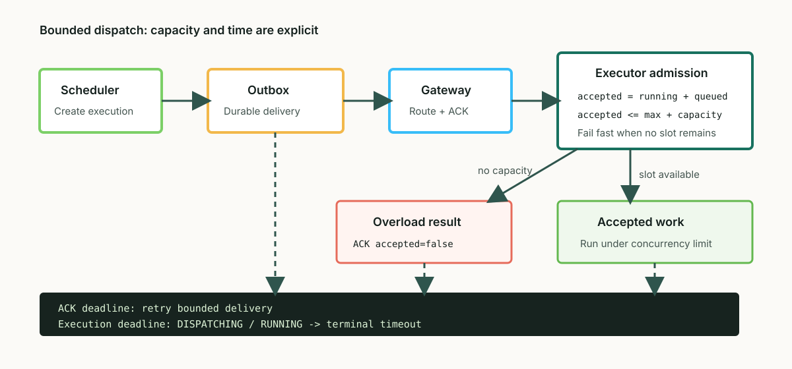

# Fail Explicitly Under Load: Production Hardening in Firefly v1.0.1

> Summary: Firefly v1.0.1 does not add more scheduling modes. It makes four production boundaries explicit: how much work an executor may accept, when a dispatch must terminate, how database state advances between versions, and when a business application must stop reporting healthy. This article explains the implementation and why those boundaries matter more than adding another retry.

Tags: Java 21, Scheduler, Netty, PostgreSQL, Spring Boot, Reliability

## Why This Matters

A scheduler looks reliable under light load: the Scheduler creates work, a Gateway locates an Executor, a handler runs, and the result reaches the database. The hard failures appear at the edges. A traffic spike grows the thread count without bound. An execution remains `DISPATCHING` after every Executor disconnects. A schema upgrade depends on an operator remembering an ad hoc statement. A Spring Boot process reports `UP` even though it cannot register with any Gateway.

These are not missing features. They are missing resource, time, and state boundaries. Firefly v1.0.1 follows four rules:

1. Perform capacity admission before accepting work.
2. Persist deadlines for dispatch and execution attempts.
3. Evolve database state through versioned SQL files.
4. Report dependency failures through health, not merely JVM liveness.



Figure 1: capacity admission, overload ACKs, Outbox retries, and execution deadlines converge failures into explicit states.

## 1. Admit Work Before Spending Resources

The previous client used `newCachedThreadPool()`. That avoids short-term queueing by converting pressure into threads. When handlers slow down or block on downstream services, thread growth transfers the cost to heap usage, context switching, and garbage collection.

v1.0.1 introduces `NettyExecutorResourceOptions`:

```java
public record NettyExecutorResourceOptions(
        int workerThreads,
        int queueCapacity,
        int maxConcurrentExecutions
) {
    public static NettyExecutorResourceOptions defaults() {
        int workers = Math.max(2, Runtime.getRuntime().availableProcessors());
        return new NettyExecutorResourceOptions(workers, 1024, workers);
    }
}
```

A Firefly-owned pool has a fixed worker count, a bounded `ArrayBlockingQueue`, and a fail-fast `AbortPolicy`. `NettyExecutorWorkScheduler` adds two semaphore boundaries:

- `acceptedSlots = maxConcurrentExecutions + queueCapacity` limits all work accepted by the client.
- `runningSlots = maxConcurrentExecutions` limits concurrent business-handler calls.

The same admission layer wraps an externally supplied `ExecutorService`. Even if that pool has an unbounded queue, Firefly does not accept unbounded work.

When capacity is exhausted, the Executor neither drops work silently nor leaves the Gateway waiting for a network timeout. The protocol emits an explicit response:

```text
ACK_JOB accepted=false reason=executor_overloaded
RESULT   status=FAILED errorMessage=executor_overloaded
```

Overload is therefore a scheduler-visible, durable, and observable result. The relevant Prometheus series are:

```text
firefly_executor_overload_acks_total
firefly_executor_client_active_executions
firefly_executor_client_queued_executions
firefly_executor_client_max_concurrent_executions
firefly_executor_client_queue_capacity
```

Pool ownership is explicit as well. Firefly shuts down pools it creates. It never shuts down a pool supplied by the application, which remains responsible for that pool's lifecycle.

## 2. `DISPATCHING` Is a Transitional State

Immediately failing a task when no Executor is online is not always correct. The connection may be temporarily absent during a rolling deployment, and a durable Outbox exists precisely to allow recovery within a bounded window. v1.0.1 keeps `DISPATCHING` as a transitional state but gives it deterministic exit conditions.

When a remote attempt is created, its execution enters `DISPATCHING` and persists `timeout_at` from the job timeout. The default job timeout is five minutes and can be changed per job. Outbox delivery operates on a shorter cycle:

```properties
firefly.dispatch.outbox.remote-ack-timeout=PT10S
firefly.dispatch.outbox.max-attempts=5
firefly.dispatch.outbox.max-retry-backoff=PT30S
firefly.execution.maintenance.interval=PT5S
```

These are two distinct time boundaries:

- The ACK deadline determines whether one remote send was accepted by an Executor.
- The execution deadline determines whether the entire attempt exceeded its allowed runtime.

A Gateway send rejection or an ACK timeout consumes a real delivery attempt. After `max-attempts`, the Outbox record becomes `DEAD` and is no longer sent automatically. Upgrade compatibility also reconstructs missing historical deadlines from `dispatch_time + timeout_value`, preventing old executions from remaining active forever.

This explains why a task without a bound or online Executor first appears as `DISPATCHING`: Firefly preserves a recovery opportunity. Delivery exhaustion or the execution deadline then converges it to a failed or timed-out terminal state instead of leaving it there indefinitely.

## 3. Database Upgrades Are Replayable Version Sequences

Schema `12` adds `password_change_required`. The more important change is the migration mechanism. Each dialect now owns an incremental file:

```text
stores/jdbc/src/main/resources/com/firefly/store/jdbc/schema/migrations/
├── h2/v12.sql
├── mysql/v12.sql
└── postgresql/v12.sql
```

Startup reads `firefly_schema_version` and loads every missing version in order:

```java
for (int version = Math.max(installed + 1, FIRST_VERSIONED_SQL_MIGRATION);
     version <= CURRENT_VERSION;
     version++) {
    for (String sql : JdbcSchemaScript.loadMigration(dialect, version)) {
        statement.execute(sql);
    }
}
```

The same design naturally extends from `11 -> 12` to `12 -> 13 -> 14`, and tests can require every incremental resource to exist. Fresh PostgreSQL installations use `scripts/postgresql/init.sql`, which creates only Firefly-owned objects. Database creation, roles, and grants remain operator-owned.

The v12 migration requires a password change only when the administrator still has the known bootstrap password digest. It does not overwrite an already changed password. This is an essential migration property: strengthen unsafe defaults without destroying state the operator already owns.

## 4. Security and Health Must Be Enforced

Documentation that says "change this before production" is not a control. In v1.0.1, cluster mode or an Admin HTTP endpoint bound outside the local host checks for bundled development credentials and refuses to start when they remain. The bootstrap `admin/admin` account must also complete its first-login password change before management APIs become available.

The Spring Boot Starter adds an Actuator `HealthIndicator` that checks more than bean construction:

- The number of registered Gateway connections.
- Executor registration failures caused by authentication or server policy.
- Declarative job synchronization status and synchronized/failed job counts.

With `autoStart=true`, zero registered Gateway connections produces `DOWN`. A failed job-registration state does the same. This can change restart and traffic-routing behavior in an orchestrator, so liveness and readiness should be configured separately instead of using aggregate `/actuator/health` as an unconditional process-liveness probe.

## 5. Verification Must Exercise Real Boundaries

The release also closes several gaps that workstation builds tend to hide:

- Gradle resolves from Maven Central by default; local repositories and mirrors require explicit opt-in.
- Isolated Maven consumers test Spring Boot 3.3, 3.4, 3.5, and 4.0.
- PostgreSQL and MySQL containers cover initialization, concurrency, and fault injection.
- Playwright exercises the primary Admin UI workflows.
- Public artifacts no longer leak `slf4j-nop`, and `netty-all` is replaced with the modules actually used.

The process-fault benchmark foundation makes targets such as scheduler-delay p99 below 500 ms and failover below 15 seconds executable. It includes independent JVM control, a TCP fault proxy, and structured reports. Precision matters here: these are SLO definitions and test infrastructure, not claimed production benchmark results. Database restarts, network partitions, and large same-second workloads still require ongoing scenario implementation and measurement.

## Tradeoffs and Operational Guidance

A bounded system exposes insufficient capacity earlier. `executor_overloaded` is not framework instability; it is deterministic process protection. A larger queue does not create throughput. It increases waiting time and memory use. Capacity should be based on handler service time, latency budgets, and instance count, with alerts on active, queued, and overload metrics.

Reliable dispatch does not mean unlimited retries. Business handlers still need an idempotency boundary. Job timeout, ACK timeout, and delivery attempts should reflect the side effects of the workload. Database upgrades require backups, and production environments using external migrations should apply the matching incremental SQL before starting in `validate` mode.

## Practical Checklist

- Evaluate concurrency per handler class instead of assuming CPU count is always optimal.
- Alert on queued executions, overload ACKs, oldest Outbox age, and DEAD records.
- Distinguish the 10-second ACK deadline from the job-level execution timeout.
- Back up existing databases and verify `firefly_schema_version` contains `12` after upgrade.
- Generate a unique JWT secret for non-local deployment and change the bootstrap administrator password immediately.
- Configure separate liveness and readiness probes in Kubernetes or an equivalent orchestrator.

## Conclusion

Scheduler reliability is not making every operation "try harder." It is knowing how much work the system can still accept, how long it may wait, who owns state, and what evidence remains after failure. Firefly v1.0.1 turns those boundaries into code: overload can be rejected, dispatch can expire, schemas can advance one version at a time, and connectivity or synchronization failures can affect health.

The changes do not eliminate failure. They turn unbounded resource use and ambiguous intermediate states into deterministic behavior that operators can monitor, test, and recover.

## Further Reading

- [Firefly v1.0.1 source](https://github.com/fishered/Firefly/tree/v1.0.1)
- [NettyExecutorWorkScheduler](https://github.com/fishered/Firefly/blob/v1.0.1/transports/netty/src/main/java/com/firefly/executor/netty/NettyExecutorWorkScheduler.java)
- [JDBC schema migrations](https://github.com/fishered/Firefly/tree/v1.0.1/stores/jdbc/src/main/resources/com/firefly/store/jdbc/schema/migrations)
