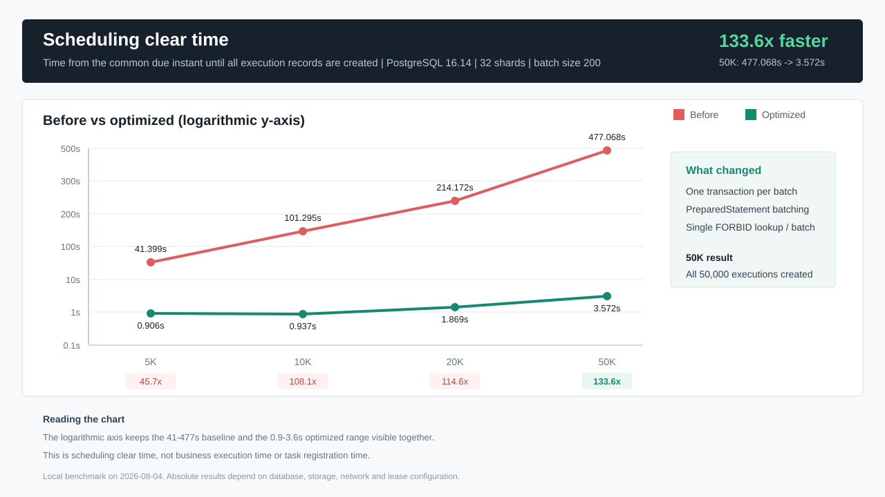
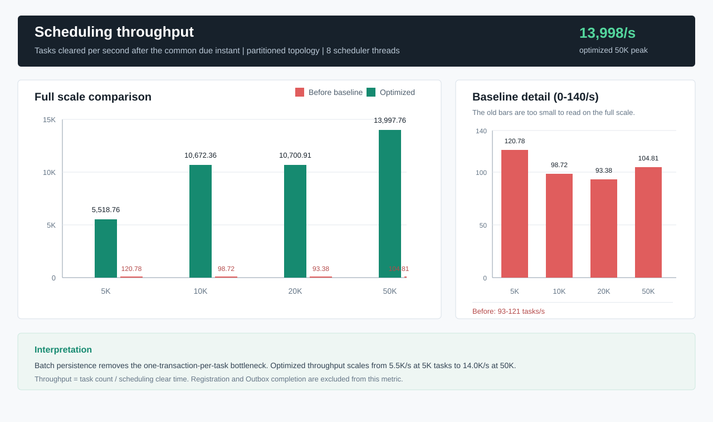
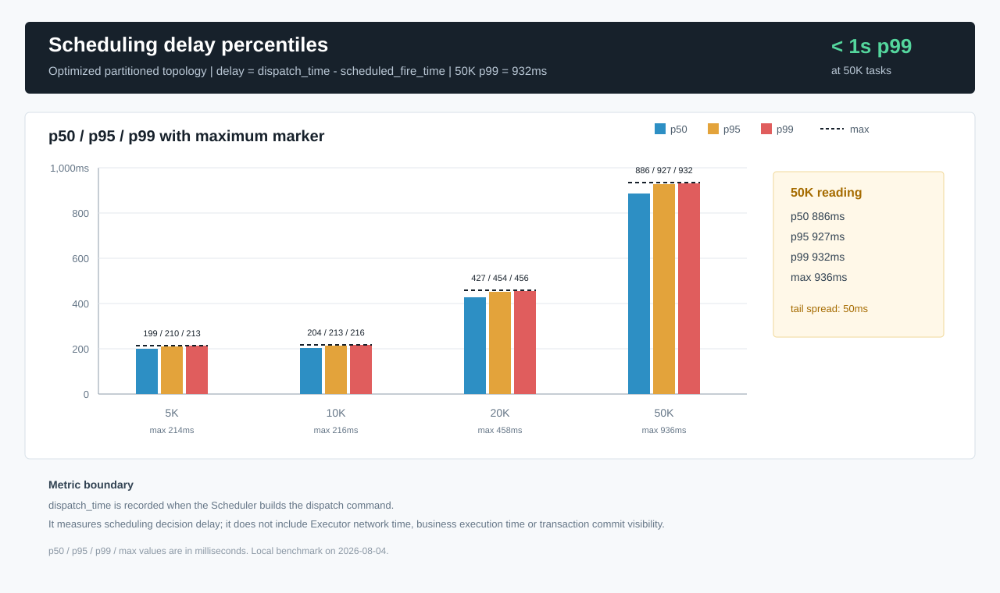
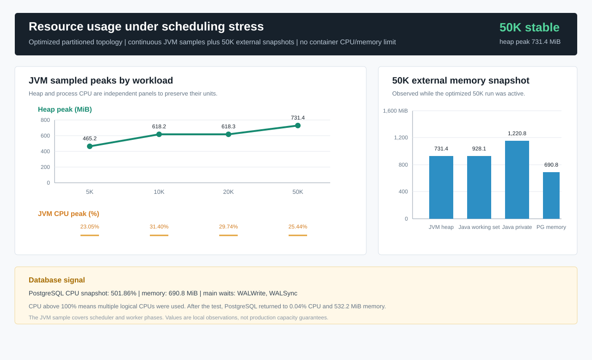
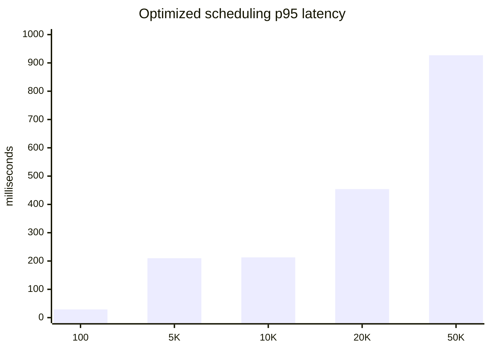

# Firefly v1.0.4 调度压力测试与优化报告

测试日期：2026-08-03 至 2026-08-04

## 结论摘要

Firefly v1.0.4 在本机 PostgreSQL 16.14 环境完成 100、5,000、10,000、20,000、50,000 个任务同一时刻到期的压力测试。

- 50,000 任务调度清空时间由 `477.068s` 降至 `3.572s`，缩短 `133.6x`。
- 优化后 50,000 任务调度吞吐约 `13,998 tasks/s`，调度决策延迟 p95 为 `927ms`、最大 `936ms`。
- 50,000 个 execution 最终全部为 `SUCCEEDED`，50,000 个 outbox 最终全部为 `DONE`。
- `duplicateClaims=0`、重复 execution ID 为 0、重复 outbox ID 为 0，未发现任务丢失或重复调度。
- 5,000 任务竞争拓扑仍通过，调度清空 `1.769s`，证明多个 Scheduler 同时竞争同一批任务时 CAS/fencing 语义有效。
- 优化后端到端主要耗时已经转移到任务逐条注册和 Outbox 完成模拟，不再是 Scheduler。

## 图表总览









## 用户问题结论

旧版 5,000 任务调度耗时约 48 秒，表示从同一时刻到期到整批 execution/outbox 创建完成需要约 48 秒，不表示每个任务执行 48 秒。它确实意味着生产环境出现大规模同刻到期积压时，尾部任务可能明显晚于计划时间。

优化后，同规格 5,000 任务在生产式分片拓扑下 `0.906s` 清空，调度决策延迟最大 `214ms`。因此旧结论中的生产风险已经显著降低，但线上仍应监控调度延迟、到期积压、WAL、连接池和 shard 分布，而不能只看平均吞吐。

## 测试环境

| 项目 | 值 |
| --- | --- |
| OS | Windows 11 10.0.26200, 64-bit |
| CPU | Intel Core i5-13600KF，14 核 / 20 逻辑处理器 |
| 主机内存 | 63.76 GiB |
| 磁盘 | Samsung SSD 980 PRO 1TB NVMe |
| Java | Oracle JDK 21.0.11 |
| Gradle | 9.6.1 |
| PostgreSQL | 16.14，`postgres:16-alpine` |
| Docker 可用内存 | 约 31.22 GiB |
| 容器资源限制 | 未设置独立 CPU / Memory limit |
| JDBC | `jdbc:postgresql://127.0.0.1:55432/firefly_stress` |
| Scheduler shards | 32 |
| 调度事务批次 | 200 |

## 压测模型

所有任务在每轮测试中使用完全相同的 `scheduled_fire_time`。为避免任务注册耗时污染调度延迟，流程调整为：

1. 将所有任务注册到一天后的初始时间。
2. 获取 32 个 shard lease。
3. 一次 SQL 将本轮任务统一设置到同一个近未来时间。
4. 等待该时间到达后，同时启动 Scheduler。
5. 等待 execution/outbox 数量达到任务总数。
6. 并发 claim、mark sent、写入成功结果并 acknowledge。
7. 校验任务游标、最终状态、重复 ID、重复 claim 和未完成 outbox。

测试包含两种 Scheduler 拓扑：

| 拓扑 | 含义 | 用途 |
| --- | --- | --- |
| `partitioned` | 32 个 shard 分给多个 Scheduler，每个 shard 只有一个 owner | 生产式吞吐和容量基准 |
| `contention` | 多个 Scheduler 同时加载并竞争全部 shard 任务 | CAS、fencing、幂等极限验证 |

## 指标定义

| 指标 | 定义 |
| --- | --- |
| 注册耗时 | 并发调用 `jobs.save()` 写入全部任务的时间 |
| 调度清空时间 | 任务到期后，到全部 execution 创建完成的时间 |
| 调度吞吐 | `jobs / schedulingMs` |
| 调度延迟 | `dispatch_time - scheduled_fire_time`，表示 Scheduler 生成调度命令的延迟 |
| Outbox 完成耗时 | 全部 outbox 从待领取到 execution/outbox 最终成功的阶段耗时 |
| 完成延迟 | worker claim 单条 outbox 后，到 mark sent、结果保存和 acknowledge 完成的耗时 |
| 总耗时 | 注册、统一到期等待、调度和 Outbox 完成的总体时间 |

`dispatch_time` 在调度命令构造时记录，因此调度延迟衡量 Scheduler 决策时间，不包含远程 Executor 网络传输和业务处理耗时。

## 慢路径诊断

优化前 `SchedulerEngine.tick()` 对每条到期任务串行调用 `advanceAndEnqueue()`。JDBC 每个任务都会执行：

1. 从连接池借用 Connection。
2. 开启单任务事务并查询数据库时间。
3. 单条 cursor CAS 和 shard lease/fencing 校验。
4. `FORBID` 任务单独查询活动 execution。
5. 分别创建 PreparedStatement 插入 execution 和 outbox。
6. 单任务 commit，触发频繁 WAL flush。

同一批 50,000 任务因此产生 50,000 次事务提交和大量 JDBC 往返。5K 到 50K 的旧吞吐长期稳定在约 `93-121 tasks/s`，与该事务模型相符。

本机没有预装 Arthas；使用 JDK 21 自带 `jcmd/JFR` 和 PostgreSQL 等待事件完成诊断。优化后 5K 完整 JFR 记录 31 秒，4 次 GC 暂停合计 `18.6ms`、最大 `8.1ms`，没有 allocation failure，GC 不是瓶颈。CPU 样本主要落在快照 URL 编码、PostgreSQL 参数绑定/`sendBind` 和批量仓储调用；PostgreSQL 运行采样主要出现 `WALWrite`、`WALSync`。这说明逐任务 commit 慢点已消除，下一步可继续优化 immutable job snapshot 编码和数据库 WAL。

## 优化内容

### 批量原子调度

- 新增 `SchedulingAdvance` 和 `advanceAndEnqueueBatch()` 仓储边界。
- Scheduler 按 `firefly.scheduler.batch-size` 拆分有界批次，默认 200。
- JDBC 每批只借用一次 Connection、查询一次数据库时间、提交一次事务。
- cursor CAS、execution insert、outbox insert 使用 PreparedStatement batch。
- 一批 `FORBID` 任务只执行一次活动 execution 集合查询。
- 只有 CAS 成功且没有活动 execution 的任务才创建 execution/outbox。

### 正确性约束

- cursor CAS 仍校验 expected `next_fire_time`。
- SQL 仍校验 shard owner、fencing token 和 lease 到期时间。
- cursor、execution、outbox 保持同一事务原子性。
- 任一 batch insert 失败时整批 rollback。
- 空 dispatch 命令保持逐条 lease-aware cursor 更新。
- 不支持批量 API 的自定义 JobRepository 自动回退原逐条方法。
- 非事务本地调度路径保持原有更新和 dispatch 顺序。

## 优化前后对比

以下旧数据使用原逐任务事务实现；5K 同日复测为 `41.399s`，此前正式记录为 `48.311s`。优化数据使用 `partitioned` 拓扑和 batch size 200。

| 任务数 | 优化前调度 | 优化后调度 | 优化前吞吐 | 优化后吞吐 | 调度提升 |
| ---: | ---: | ---: | ---: | ---: | ---: |
| 5,000 | 41.399 s | 0.906 s | 120.78/s | 5,518.76/s | 45.7x |
| 10,000 | 101.295 s | 0.937 s | 98.72/s | 10,672.36/s | 108.1x |
| 20,000 | 214.172 s | 1.869 s | 93.38/s | 10,700.91/s | 114.6x |
| 50,000 | 477.068 s | 3.572 s | 104.81/s | 13,997.76/s | 133.6x |

旧版 5K 正式记录 `48.311s` 与同日复测 `41.399s` 存在本机运行波动；使用正式记录计算时，5K 提升为 `53.3x`。

### 优化后阶段耗时

| 任务数 | 注册 | 调度 | Outbox 完成 | 总耗时 |
| ---: | ---: | ---: | ---: | ---: |
| 100 | 0.451 s | 0.063 s | 0.379 s | 2.185 s |
| 5,000 | 19.650 s | 0.906 s | 8.745 s | 30.584 s |
| 10,000 | 40.313 s | 0.937 s | 14.985 s | 57.516 s |
| 20,000 | 84.952 s | 1.869 s | 17.835 s | 105.874 s |
| 50,000 | 191.358 s | 3.572 s | 46.004 s | 242.239 s |

50K 端到端总耗时由旧版 `728.003s` 降为 `242.239s`，约缩短 `3.0x`。总耗时没有达到 133.6x，是因为任务注册和 Outbox 完成模拟未使用本次 Scheduler 批量优化。

## 调度延迟

| 任务数 | p50 | p95 | p99 | max |
| ---: | ---: | ---: | ---: | ---: |
| 100 | 29 ms | 29 ms | 29 ms | 29 ms |
| 5,000 | 199 ms | 210 ms | 213 ms | 214 ms |
| 10,000 | 204 ms | 213 ms | 216 ms | 216 ms |
| 20,000 | 427 ms | 454 ms | 456 ms | 458 ms |
| 50,000 | 886 ms | 927 ms | 932 ms | 936 ms |



## 拓扑对比

| 5K 场景 | 调度清空 | 吞吐 | 调度 p95 | 结果 |
| --- | ---: | ---: | ---: | --- |
| `partitioned` | 0.906 s | 5,518.76/s | 210 ms | 无丢失、无重复 |
| `contention` | 1.769 s | 2,826.46/s | 534 ms | 无丢失、无重复 |

竞争拓扑慢约 1.95 倍，因为多个 Scheduler 会构造相同命令并提交 cursor CAS，只有一个成功，其余批次产生额外数据库工作。生产部署应让 coordinator 保证每个 shard 在同一时刻只有一个有效 owner。

## 资源占用

### JVM 连续采样

测试 JVM 每 100ms 采样 process CPU load、heap 和 non-heap。

| 任务数 | JVM CPU 观测峰值 | Heap 观测峰值 | Non-heap 观测峰值 |
| ---: | ---: | ---: | ---: |
| 5,000 | 23.05% | 465.2 MiB | 约 34 MiB |
| 10,000 | 31.40% | 618.2 MiB | 约 35 MiB |
| 20,000 | 29.74% | 618.3 MiB | 约 36 MiB |
| 50,000 | 25.44% | 731.4 MiB | 36.1 MiB |

50K 外部进程快照：Java Working Set `928.1 MiB`，Private Memory `1,220.8 MiB`。这比旧实现 50K 成功轮次观察到的约 `4,296 MiB Working Set / 4,709 MiB Private` 明显降低，原因是批量调度缩短了大量命令和数据库对象同时存活的时间。

### PostgreSQL 运行快照

| 指标 | 50K 运行中观测值 |
| --- | ---: |
| CPU | 501.86% |
| Memory | 690.8 MiB / 31.22 GiB |
| 主要等待 | `WALWrite`、`WALSync` |
| 测试后 CPU | 0.04% |
| 测试后 Memory | 532.2 MiB |

容器 CPU 超过 100% 表示 PostgreSQL 使用多个逻辑 CPU。优化后数据库 CPU 利用率明显提高，这是减少串行事务等待后的预期结果；下一阶段容量瓶颈更可能是 WAL、磁盘和 PostgreSQL 并发，而不是 Scheduler Java 线程。

## 完整性结果

| 校验项 | 50K 结果 |
| --- | ---: |
| `firefly_job` | 50,000 |
| `firefly_execution` | 50,000 |
| `firefly_dispatch_outbox` | 50,000 |
| `SUCCEEDED` | 50,000 |
| `DONE` | 50,000 |
| duplicate claims | 0 |
| duplicate execution IDs | 0 |
| duplicate outbox IDs | 0 |
| 未推进任务游标 | 0 |
| 非终态 outbox | 0 |

## 验证范围

- 新增 JDBC batch 全成功、部分 CAS 失败、`FORBID` 活动 execution、批量写失败整批回滚测试。
- Scheduler 原有 misfire、catch-up、tick budget 和普通调度测试全部通过。
- `gradle test` 全模块通过，覆盖 JDBC、Server、Outbox、Netty、Executor、Admin API 和远程执行链路。
- 100、5K、10K、20K、50K PostgreSQL 压测全部通过。

## 执行命令

50K 生产式分片压测：

```powershell
E:\gradle-9.6.1\bin\gradle.bat :stores:jdbc:stressTest --no-daemon --rerun-tasks `
  "-Dfirefly.stress.jfr.path=E:\workSpace\firefly\build\reports\stress\optimized-partitioned-50k.jfr" `
  "-Dfirefly.stress.maxHeap=8g" `
  "-Dfirefly.stress.workerTimeoutSeconds=2400" `
  "-Dfirefly.stress.jdbc.url=jdbc:postgresql://127.0.0.1:55432/firefly_stress" `
  "-Dfirefly.stress.jdbc.username=postgres" `
  "-Dfirefly.stress.jdbc.password=123456" `
  "-Dfirefly.stress.jobs=50000" `
  "-Dfirefly.stress.registrationThreads=16" `
  "-Dfirefly.stress.schedulerThreads=8" `
  "-Dfirefly.stress.outboxWorkers=32" `
  "-Dfirefly.stress.claimBatchSize=300" `
  "-Dfirefly.stress.maxConnections=96" `
  "-Dfirefly.stress.topology=partitioned" `
  "-Dfirefly.stress.schedulingBatchSize=200" `
  "-Dfirefly.stress.jobTimeoutMinutes=30" `
  "-Dfirefly.stress.phaseTimeoutSeconds=2400" `
  "-Dfirefly.stress.report.path=build/reports/stress/optimized-partitioned-50k.json"
```

应用运行参数：

```properties
firefly.scheduler.batch-size=200
firefly.scheduler.max-due-records-per-tick=10000
firefly.scheduler.max-idle-wakeup=PT0.5S
```

## 原始产物

| 产物 | 路径 |
| --- | --- |
| 结构化汇总 | `docs/assets/firefly-v1.0.4-stress-results.json` |
| 调度耗时图 | `docs/assets/firefly-v1.0.4-scheduling-duration.svg` |
| 调度吞吐图 | `docs/assets/firefly-v1.0.4-scheduling-throughput.svg` |
| 调度延迟图 | `docs/assets/firefly-v1.0.4-scheduling-latency.svg` |
| 资源占用图 | `docs/assets/firefly-v1.0.4-resource-usage.svg` |
| 优化前 5K JSON | `stores/jdbc/build/reports/stress/before-optimization-5k.json` |
| 优化后 5K JSON | `stores/jdbc/build/reports/stress/optimized-partitioned-5k.json` |
| 优化后 10K JSON | `stores/jdbc/build/reports/stress/optimized-partitioned-10k.json` |
| 优化后 20K JSON | `stores/jdbc/build/reports/stress/optimized-partitioned-20k.json` |
| 优化后 50K JSON | `stores/jdbc/build/reports/stress/optimized-partitioned-50k.json` |
| 5K 竞争拓扑 JSON | `stores/jdbc/build/reports/stress/optimized-contention-5k.json` |
| 优化前 JFR 短样本 | `build/reports/stress/before-optimization-5k.jfr` |
| 优化后 5K 完整 JFR | `build/reports/stress/optimized-partitioned-5k.jfr` |

## 风险与生产建议

- 结果是本机单 PostgreSQL 容器数据，不能直接等价为云数据库或跨网络生产环境容量。
- 当前 50K p95 调度延迟低于 1 秒；若生产 SLO 更严格，应减少同刻到期任务、增加 shard owner 或提升 PostgreSQL/WAL 能力。
- batch size 200 是本机验证值。更大批次可能继续提高吞吐，但会增加事务时长、rollback 成本和 lease 过期风险。
- JDBC 连接数不应简单随 Scheduler 线程无限增加；本轮 8 个 partitioned Scheduler 已能达到约 14K tasks/s。
- 任务注册仍是逐条事务，50K 注册耗时 `191.358s`。若存在大规模批量创建任务的业务需求，应单独设计 `saveBatch()`，不要把它误认为到期调度性能。
- Outbox worker 测试模拟了持久化状态闭环，没有包含真实业务 Executor 的网络、线程池和业务执行时间；生产还需分别压测 Gateway/Executor。
- 优化后 JFR 中 `URLEncoder`/snapshot codec 是最高 Java CPU 样本，若继续追求更高调度吞吐，可优先缓存或替换 immutable job snapshot 的编码路径。
- 应持续监控 `schedule delay p95/p99/max`、due backlog、CAS 失败、JDBC pool wait、WAL write/sync、Outbox oldest age 和 dead dispatch 数量。

## 最终结论

Firefly v1.0.4 的 PostgreSQL 调度关键路径已从逐任务事务改为有界批量原子事务。在 50,000 个任务同一时刻到期的压力下，调度清空时间从 477 秒降到 3.6 秒以内，调度决策延迟 p99 为 932ms，任务与 Outbox 全部正确收敛，无丢失、无重复。当前 Scheduler 性能已经不再是本机端到端压测的首要瓶颈。
